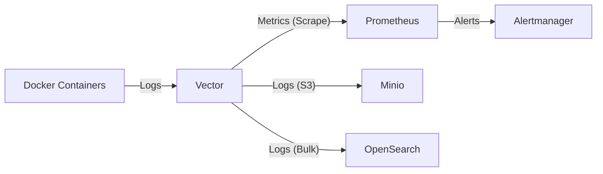

# Logs Platform

A comprehensive logging and monitoring solution based on **Vector**, **Prometheus**, **Alertmanager**, **Minio**, and **OpenSearch**, running on Docker Compose.

## 🚀 Overview

This platform collects logs from Docker containers, processes them using Vector, stores them in S3-compatible storage (Minio) and OpenSearch, and exposes metrics to Prometheus. It demonstrates a modern observability pipeline where logs are stored, indexed, and transformed into metrics for monitoring and alerting.

### Components

- **[Vector](https://vector.dev/)**: High-performance observability data pipeline.
  - Collects Docker logs.
  - Filters logs containing specific keywords (e.g., "hello-world").
  - Generates custom metrics (counters) from log events.
  - Exposes metrics for Prometheus scraping.
  - Sends logs to Minio (S3) and OpenSearch.
- **[Prometheus](https://prometheus.io/)**: Systems monitoring and alerting toolkit.
  - Scrapes metrics from Vector and its own internal metrics.
  - Stores time-series data.
- **[Alertmanager](https://prometheus.io/docs/alerting/latest/alertmanager/)**: Handles alerts sent by client applications such as Prometheus.
- **[Minio](https://min.io/)**: S3-compatible object storage.
  - Stores logs in JSON format (gzip compressed).
  - Provides S3 API and web console.
- **[OpenSearch](https://opensearch.org/)**: Open-source search and analytics suite.
  - Indexes logs for full-text search.
  - Provides REST API for querying.
- **[OpenSearch Dashboards](https://opensearch.org/docs/latest/dashboards/)**: Visualization and exploration platform for OpenSearch.
  - Provides web UI for searching and visualizing logs.
  - Supports creating dashboards, visualizations, and queries.

## 🛠️ Architecture



## 📋 Prerequisites

- Docker
- Docker Compose
- **Important**: OpenSearch requires `vm.max_map_count` to be at least 262144:
  ```bash
  sudo sysctl -w vm.max_map_count=262144
  ```
  To make this permanent, add `vm.max_map_count=262144` to `/etc/sysctl.conf`.

## 🏁 Getting Started

1. **Clone the repository:**
   ```bash
   git clone <repository-url>
   cd vector
   ```

2. **Set vm.max_map_count (required for OpenSearch):**
   ```bash
   sudo sysctl -w vm.max_map_count=262144
   ```

3. **Start the stack:**
   ```bash
   sudo docker-compose up -d
   ```

4. **Verify services are running:**
   ```bash
   sudo docker-compose ps
   ```

## 🔌 Service Endpoints

| Service | URL | Description |
|---------|-----|-------------|
| **Vector API** | `http://localhost:8686` | Vector GraphQL API & Playground |
| **Vector Metrics** | `http://localhost:9598/metrics` | Raw metrics exposed by Vector |
| **Prometheus** | `http://localhost:9090` | Prometheus Web UI |
| **Alertmanager** | `http://localhost:9093` | Alertmanager Web UI |
| **Minio Console** | `http://localhost:9001` | Minio Web Console (minioadmin/minioadmin) |
| **Minio API** | `http://localhost:9000` | Minio S3 API |
| **OpenSearch** | `http://localhost:9200` | OpenSearch REST API |
| **OpenSearch Dashboards** | `http://localhost:5601` | OpenSearch Web UI for log exploration |

## ⚙️ Configuration

### Vector (`vector.yaml`)
Configured to:
- Read logs from the Docker socket.
- **Transform**: Filters logs containing `"hello-world"`.
- **Metric Generation**: Counts occurrences of "hello-world" and exposes them as `hello_world_occurrences_total`.
- **Sinks**:
  - **Minio**: Stores logs in S3 bucket `logs` (JSON format, gzip compressed).
  - **OpenSearch**: Indexes logs in daily indices `logs-YYYY-MM-DD`.
  - **Prometheus Exporter**: Exposes metrics on port 9598.

### Prometheus (`prometheus.yaml`)
- Scrapes Vector metrics from `vector:9598`.
- Scrapes its own metrics.
- Connects to Alertmanager.

### Minio
- **Bucket**: `logs` (automatically created on startup)
- **Credentials**: minioadmin / minioadmin
- **Data**: Stored in Docker volume `minio_data`

### OpenSearch
- **Mode**: Single-node cluster
- **Security**: Disabled for development
- **Indices**: Daily indices `logs-YYYY-MM-DD`
- **Data**: Stored in Docker volume `opensearch_data`

## 🧪 Testing the Pipeline

You can verify the log-to-metric pipeline by generating a log message containing "hello-world".

1. **Generate a test log:**
   ```bash
   sudo docker run --rm alpine echo "This is a hello-world test"
   ```

2. **Check the metric in Vector:**
   ```bash
   curl -s http://localhost:9598/metrics | grep hello_world_occurrences_total
   ```

3. **Check the metric in Prometheus:**
   - Open [http://localhost:9090/graph](http://localhost:9090/graph)
   - Search for `hello_world_occurrences_total`
   - Click "Execute"

4. **Check logs in OpenSearch:**
   ```bash
   # Count documents
   curl "http://localhost:9200/logs-*/_count"
   
   # Search logs
   curl "http://localhost:9200/logs-*/_search?pretty&size=5"
   ```

5. **Explore logs in OpenSearch Dashboards:**
   - Open [http://localhost:5601](http://localhost:5601)
   - Go to **Management** → **Stack Management** → **Index Patterns**
   - Create an index pattern: `logs-*`
   - Set time field: `timestamp` or `@timestamp`
   - Go to **Discover** to explore your logs

6. **Check logs in Minio:**
   - Open [http://localhost:9001](http://localhost:9001)
   - Login with `minioadmin` / `minioadmin`
   - Browse the `logs` bucket
   - Or via CLI:
     ```bash
     sudo docker exec minio ls -lah /data/logs/
     ```

## 🔧 Troubleshooting

- **DNS Resolution**: If Prometheus cannot connect to Vector, ensure they are on the same Docker network (`monitoring`).
- **Port Conflicts**: Vector API uses port `8686` and the Prometheus exporter uses `9598` to avoid conflicts.
- **OpenSearch not starting**: Ensure `vm.max_map_count` is set to at least 262144.
- **Minio bucket not created**: Check logs with `sudo docker-compose logs createbuckets`.
- **No logs in OpenSearch**: Generate new logs after Vector starts, as it only captures logs from the moment it starts.

## 📊 Data Storage

- **Prometheus Data**: `prometheus_data` volume
- **Alertmanager Data**: `alertmanager_data` volume
- **Minio Data**: `minio_data` volume (S3 objects)
- **OpenSearch Data**: `opensearch_data` volume (indices)

## 🧹 Cleanup

To stop and remove all containers, networks, and volumes:

```bash
sudo docker-compose down -v
```

**Warning**: This will delete all stored logs and metrics!

