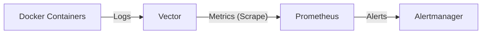

# Logs Platform

A comprehensive logging and monitoring solution based on **Vector**, **Prometheus**, and **Alertmanager**, running on Docker Compose.

## 🚀 Overview

This platform collects logs from Docker containers, processes them using Vector, and exposes metrics to Prometheus. It demonstrates a modern observability pipeline where logs are transformed into metrics for monitoring and alerting.

### Components

- **[Vector](https://vector.dev/)**: High-performance observability data pipeline.
  - Collects Docker logs.
  - Filters logs containing specific keywords (e.g., "hello-world").
  - Generates custom metrics (counters) from log events.
  - Exposes metrics for Prometheus scraping.
- **[Prometheus](https://prometheus.io/)**: Systems monitoring and alerting toolkit.
  - Scrapes metrics from Vector and its own internal metrics.
  - Stores time-series data.
- **[Alertmanager](https://prometheus.io/docs/alerting/latest/alertmanager/)**: Handles alerts sent by client applications such as Prometheus.

## 🛠️ Architecture



## 📋 Prerequisites

- Docker
- Docker Compose

## 🏁 Getting Started

1. **Clone the repository:**
   ```bash
   git clone <repository-url>
   cd vector
   ```

2. **Start the stack:**
   ```bash
   docker compose up -d
   ```

3. **Verify services are running:**
   ```bash
   docker compose ps
   ```

## 🔌 Service Endpoints

| Service | URL | Description |
|---------|-----|-------------|
| **Vector API** | `http://localhost:8686` | Vector GraphQL API & Playground |
| **Vector Metrics** | `http://localhost:9598/metrics` | Raw metrics exposed by Vector |
| **Prometheus** | `http://localhost:9090` | Prometheus Web UI |
| **Alertmanager** | `http://localhost:9093` | Alertmanager Web UI |

## ⚙️ Configuration

### Vector (`vector.yaml`)
Configured to:
- Read logs from the Docker socket.
- **Transform**: Filters logs containing `"hello-world"`.
- **Metric Generation**: Counts occurrences of "hello-world" and exposes them as `hello_world_occurrences_total`.

### Prometheus (`prometheus.yaml`)
- Scrapes Vector metrics from `vector:9598`.
- Scrapes its own metrics.
- Connects to Alertmanager.

## 🧪 Testing the Pipeline

You can verify the log-to-metric pipeline by generating a log message containing "hello-world".

1. **Generate a test log:**
   ```bash
   docker run --rm alpine echo "This is a hello-world test"
   ```

2. **Check the metric in Vector:**
   ```bash
   curl -s http://localhost:9598/metrics | grep hello_world_occurrences_total
   ```

3. **Check the metric in Prometheus:**
   - Open [http://localhost:9090/graph](http://localhost:9090/graph)
   - Search for `hello_world_occurrences_total`
   - Click "Execute"

## 🔧 Troubleshooting

- **DNS Resolution**: If Prometheus cannot connect to Vector, ensure they are on the same Docker network (`monitoring`).
- **Port Conflicts**: Vector API uses port `8686` and the Prometheus exporter uses `9598` to avoid conflicts.
